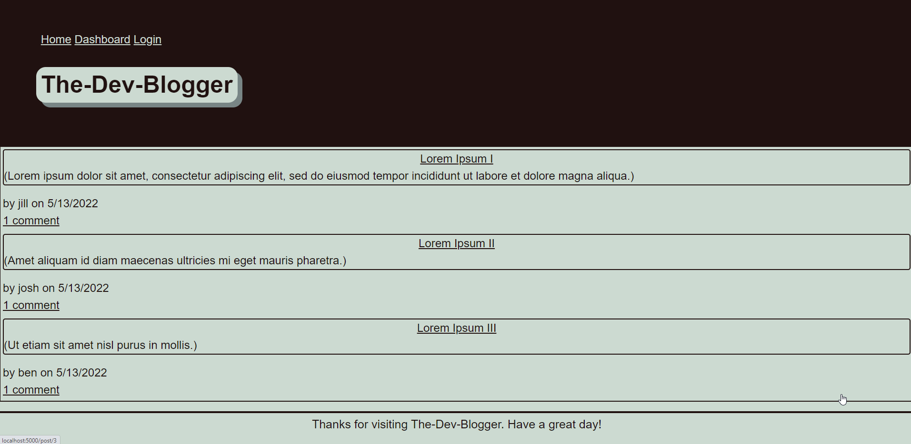

# The-Dev-Blogger

Writing about tech can be just as important as making it. Developers spend plenty of time creating new applications and debugging existing codebases, but most developers also spend at least some of their time reading and writing about technical concepts, recent advancements, and new technologies. A simple Google search for any concept covered in this course returns thousands of think pieces and tutorials from developers of all skill levels!

Therefore this ia  a CMS-style blog site similar to a Wordpress site, where developers can publish their blog posts and comment on other developers’ posts as well. The application is built completely from scratch and deployed to Heroku. The app follows the MVC paradigm in its architectural structure, using Handlebars.js as the templating language, Sequelize as the ORM, and the express-session npm package for authentication.

## Usage

* express-handlebars
* MySQL2
* Sequelize
* dotenv
* bcrypt
* express-session
* connect-session-sequelize

## Install

* clone github repo.
* npm run seed to seed database.
* npm start.

###

[Link to Deployed Application](https://afternoon-cove-66194.herokuapp.com/)

### Questions

Any questions? You can contact me directly at jwputah7@gmail.com

Or visit my 

